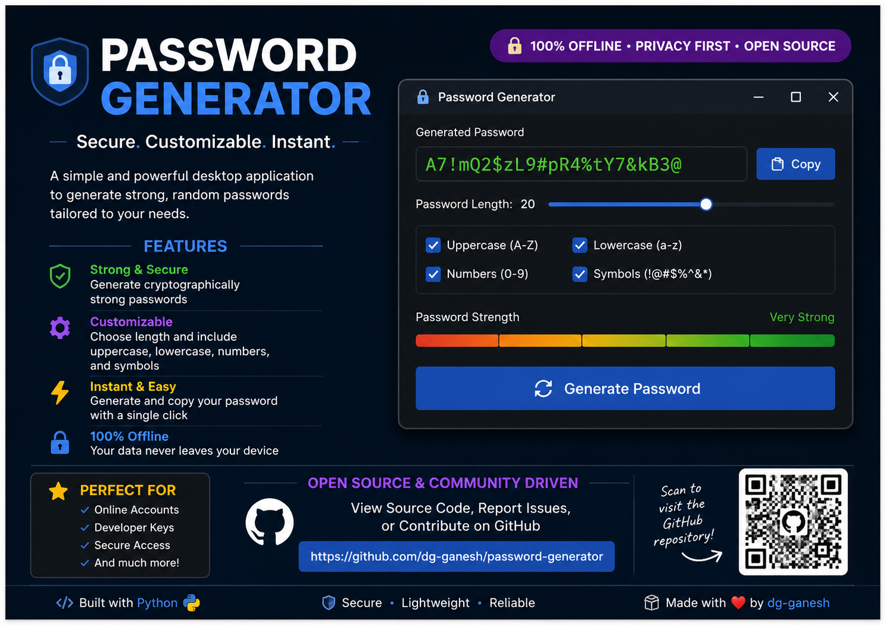
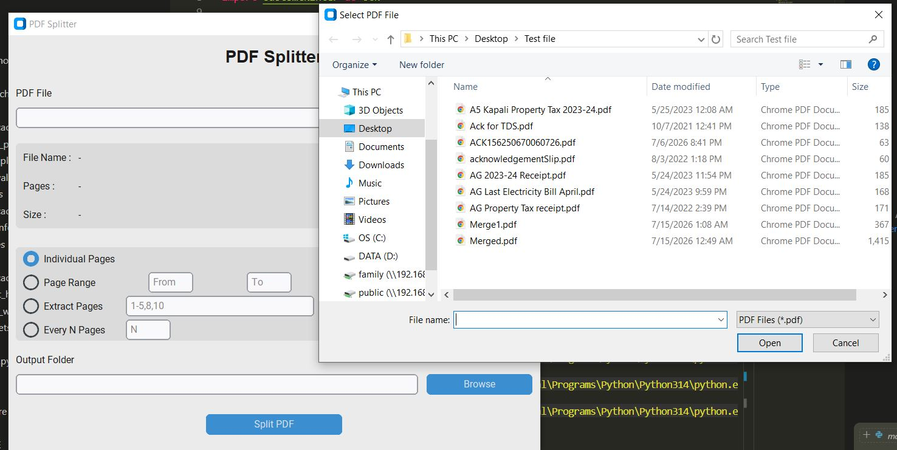
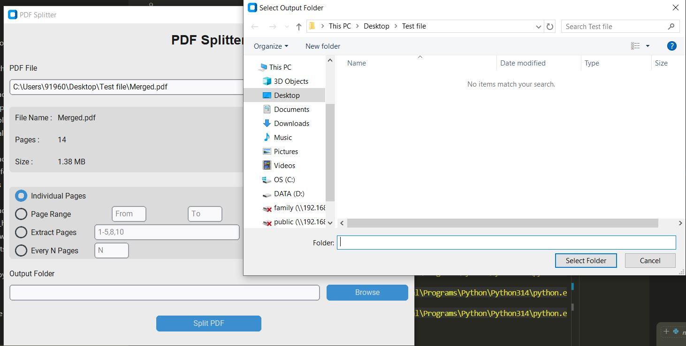
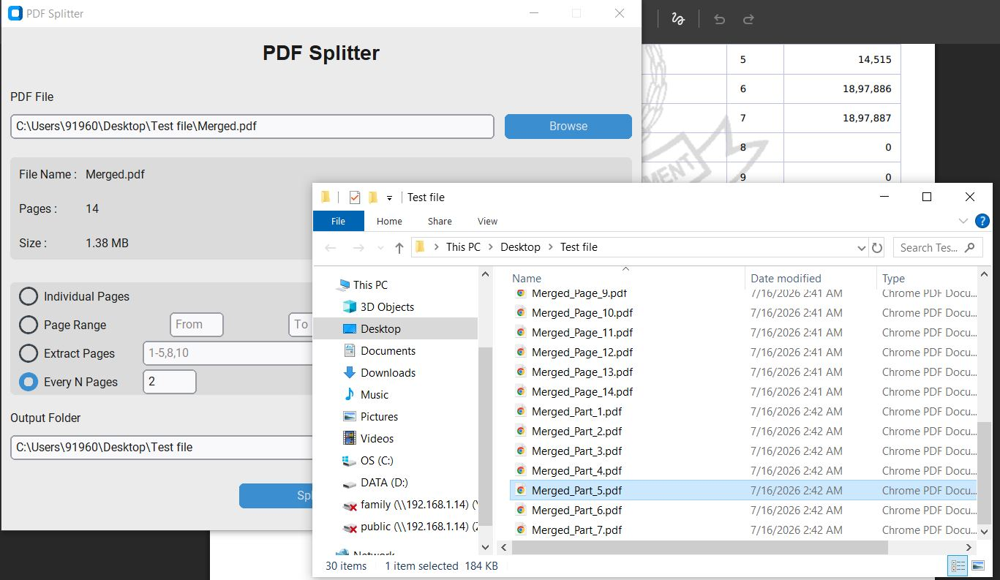

# 

---

# Badges


---

# Screenshots

## Homepage


---

## File Selection



---

## Output Folder Selection



---

## Output Display



---

# PDF Splitter

## Project Information

| Item | Value |
|------|-------|
| Project | PDF Splitter |
| Project ID | 008 |
| Version | 1.0.0 |
| Language | Python |
| Platform | Windows |
| GUI Framework | CustomTkinter |
| Status | Stable |

---

# Project Overview

## Purpose

PDF Splitter is a desktop application that allows users to split PDF documents into smaller files using several common splitting methods.

## Problem Solved

Large PDF documents are often difficult to share, archive, or organize. This application provides a simple interface for extracting or splitting pages without requiring commercial PDF software.

## Typical Use Cases

- Split every page into separate PDF files.
- Extract a specific page range.
- Extract selected pages.
- Split large documents into equal-sized parts.
- Organize reports and scanned documents.

---

# Features

- Browse and load PDF documents.
- Display PDF information.
- Split every page into an individual PDF.
- Split by page range.
- Extract selected pages.
- Split every N pages.
- Select output folder.
- Automatic PDF validation.
- Status updates during processing.
- Automatically opens the output folder after successful completion.

---

# Technology Stack

| Category | Technology |
|-----------|------------|
| Language | Python 3.14 |
| GUI | CustomTkinter |
| PDF Processing | pypdf |
| File System | pathlib |
| Packaging | PyInstaller |
| Version Control | Git |
| Repository Hosting | GitHub |

---

# Project Structure

```text
PDF-Splitter/
│
├── main.py
│
├── src/
│   ├── config.py
│   │
│   ├── ui/
│   │   ├── widgets.py
│   │   ├── event_handlers.py
│   │   └── main_window.py
│   │
│   ├── core/
│   │   ├── page_parser.py
│   │   ├── pdf_validator.py
│   │   └── pdf_splitter.py
│   │
│   ├── services/
│   │   ├── file_service.py
│   │   └── pdf_service.py
│   │
│   └── models/
│       └── pdf_info.py
│
├── assets/
├── data/
├── screenshots/
├── docs/
├── releases/
├── tests/
│
├── requirements.txt
├── README.md
└── LICENSE
```

---

# Module Overview

| Module | Responsibility |
|----------|----------------|
| UI | User Interface and event handling |
| Core | PDF splitting business logic |
| Services | File system and PDF operations |
| Models | PDF metadata representation |

---

# Source Code Overview

| Source File | Purpose | Dependencies |
|-------------|----------|--------------|
| `main.py` | Application entry point responsible for launching the desktop application. | CustomTkinter |
| `src/config.py` | Stores application configuration values and global constants. | pathlib |
| `src/ui/main_window.py` | Creates the main application window and arranges the interface. | CustomTkinter |
| `src/ui/widgets.py` | Creates all user interface controls used by the application. | CustomTkinter |
| `src/ui/event_handlers.py` | Handles user actions and coordinates UI with business logic. | CustomTkinter, PDFSplitter |
| `src/core/page_parser.py` | Parses user-entered page selections and page ranges. | Python Standard Library |
| `src/core/pdf_validator.py` | Validates PDF files and user inputs before processing. | PDFInfo |
| `src/core/pdf_splitter.py` | Implements the application's PDF splitting logic. | PDFService, FileService, PageParser |
| `src/services/file_service.py` | Provides file browsing and folder management services. | CustomTkinter |
| `src/services/pdf_service.py` | Encapsulates all interactions with the pypdf library. | pypdf |
| `src/models/pdf_info.py` | Represents metadata associated with a loaded PDF document. | dataclasses |

---

# How to Run

## Prerequisites

- Python 3.14 or later
- Required Python packages installed

## Install Dependencies

```bash
pip install -r requirements.txt
```

## Run the Application

```bash
python main.py
```

---

# How to Build

## Generate Executable

Build the application using PyInstaller.

```bash
pyinstaller --onefile --windowed --name PDF-Splitter main.py
```

## Output Location

After the build completes, the executable will be available in:

```text
dist/
└── PDF-Splitter.exe
```

---

# Version

| Item | Value |
|------|-------|
| Current Version | 1.0.0 |
| Release Date | July 2026 |
| Status | Stable |

---

# Development Workflow

```text
Requirements
      ↓
Build Planning
      ↓
Project Structure
      ↓
Implementation
      ↓
Integration Review
      ↓
Functional Testing
      ↓
Code Freeze
      ↓
Executable Build
      ↓
Documentation
      ↓
GitHub Release
```

---

# License

This project is licensed under the **MIT License**.

See the `LICENSE` file for complete licensing information.

---

# Author

**Ganesh DG**

GitHub: https://github.com/dg-ganesh

---

# Acknowledgements

This project was developed as part of a personal software engineering portfolio focused on building practical desktop utilities using Python. The objective is to apply consistent engineering practices, modular architecture, and standardized documentation across all projects in the portfolio.